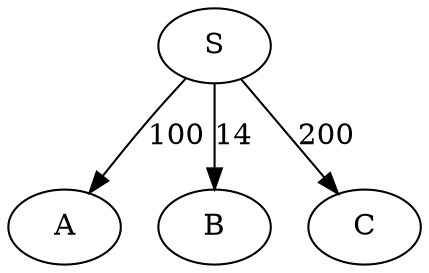

Rewritten from scratch. `goraph` is a pure Go library for graph data structure. I didn't write this for production, rather as a reference and to practice. This is a good example of dealing with pointers and data structures in Go. Regarding graph APIs, I highly recommend <a href="http://google-opensource.blogspot.co.uk/2014/06/cayley-graphs-in-go.html" target="_blank">Cayley</a>.


goraph [](https://travis-ci.org/gyuho/goraph) [](http://godoc.org/github.com/gyuho/goraph) [](http://www.ohloh.net/p/714468)
==========

Package goraph implements graph data structures and algorithms. It interacts with DOT and JSON format files.

To visualize, use the method [`ToDOTFile`](https://github.com/gyuho/goraph/blob/master/graph/gs/graph_method.go#L152) and open the `dot` file with `Graphviz`. Examples can be found [here](https://github.com/gyuho/goraph/tree/master/usage).

- [Getting Started](#getting-started)
- [Package Hierarchy](#package-hierarchy)
- [Sample Usage](#sample-usage)
- [List(Linked List) vs. Slice(Array)](#listlinked-list-vs-slicearray)
- [What is Graph? (YouTube Clips)](#what-is-graph-youtube-clips)
- [Adjacency List vs. Adjacency Matrix](#adjacency-list-vs-adjacency-matrix)
- [Channel](#channel)
- [C++ Version](#c-version)
- [package gotree](#package-gotree)


Getting Started
==========
- [godoc.org](http://godoc.org/github.com/gyuho/goraph)
- [gowalker.org](http://gowalker.org/github.com/gyuho/goraph#_index)

```go
go get github.com/gyuho/goraph
```

`goraph` uses the package `gs` as default, which discourage to have duplicate edges but still provides ways to implement it. Default formats are `JSON` and `DOT` as follows:

```json
{
    "testgraph": {
        "S": {
            "A": [100],
            "B": [14],
            "C": [200]
        },
        "A": {
            "S": [15],
            "B": [5],
            "D": [20],
            "T": [44]
        }
    }
}
```



[↑ top](https://github.com/gyuho/goraph#goraph---)


Package Hierarchy
==========
```go
goraph

	algorithm 			// Graph Algorithms
	
		bfs				// Breadth First Search (BFS)
		dfs				// Depth First Search (DFS)
		
		maxflow			// Maximum Flow
			fdfk		// Ford-Fulkerson's Maximum Network Flow
			
		mst 			// Minimum Spanning Tree
			kruskal		// Kruskal's Minimum Spanning Tree
			prim		// Prim's Minimum Spanning Tree
			
		scc 			// Strongly Connected Components
			kosaraju	// Kosaraju's Strongly Connected Components
			tarjan		// Tarjan's Strongly Connected Components
			
		sp 				// Shortest Path
		spbf			// Shortest Path using Bellman-Ford algorithm
		spd				// Shortest Path using Dijkstra algorithm
		spfw			// Shortest Path using Floyd-Warshall algorithm
		
		tsdag			// Topological Sort
		tsdfs			// Topological Sort using DFS
		tskahn			// Topological Sort based on Arthur Kahn(1962)'s paper
	
	
	goroup				// Set Theory
	
	gosequence			// Sequence using slice
	
	
	graph 				// Graph Data Structure
		gl 				// Adjacency List, `container/list`
		gm 				// Map Data Structure
		gs 				// Slice, Sequence (Default in Goraph)
		gt 				// Adjacency Matrix
		
		helper			// Helper function for graphs
		
		
	gson 				// JSON Encoding, Decoding
	
	parsex				// Parser for JSON, DOT files
		dotx 			// `dot` file parser
		dotxd			// allow duplicate edges
		jsonx 			// `json` file parser
		jsonxd			// allow duplicate edges
	
	usage 				// Example Scripts, Programs
```

[↑ top](https://github.com/gyuho/goraph#goraph---)


Sample Usage
==========

[Code](./usage/algorithm-visualize/spd) to calculate and visualize the shortest path from `S` to `T`:
```go
package main

import (
	"github.com/gyuho/goraph/algorithm/spd"
	"github.com/gyuho/goraph/graph/gs"
)

func main() {
	g4 := gs.FromJSON("../../../files/testgraph.json", "testgraph.004")
	spd.VizDOTFile(g4, g4.FindVertexByID("S"), g4.FindVertexByID("T"), "test.dot")
}
```


**Output**:


More examples can be found [here](./usage/).

[↑ top](https://github.com/gyuho/goraph#goraph---)


List(Linked List) vs. Slice(Array)
========
Goraph mainly uses customized slice(array) data structure implemented in package gsd, instead of using linked list. To store vertices and edges, we can either use "container/list" or slice(array) data structure. It depends on the number of elements in the lists. Linked list will be more efficient, when we need to do many deletions in the 'middle' of the list. The more elements we have in graph , the less efficient a slice becomes. When the ordering of the elements isn't important, then it is most efficient to use a slice and deleting an element by replacing it by the last element and reslicing to shrink the size(len) by 1. We can mitigate the deletion problem using this slice trick but there is no way to mitigate the slowness of traversing linked list. Both ways are implemented, but mainly this will be run with slice. 

Here's my benchmarks on "[List(Linked List) vs. Slice(Array)](https://github.com/gyuho/goraph/tree/master/graph/graph-iterate_test.go)", in which `slice` is **x20,000** faster than `linked list` when traversing 5,0000 nodes.

<b>Reference</b>
<ul>
	<li><a href="https://groups.google.com/d/msg/golang-nuts/mPKCoYNwsoU/tLefhE7tQjMJ" target="_blank">Go(Golang) Slice vs. List?</a></li>
	<li><a href="http://www.youtube.com/watch?v=YQs6IC-vgmo" target="_blank">Bjarne Stroustrup: Why you should avoid Linked Lists (C++)</a></li>
	<li><a href="http://www.codeproject.com/Articles/340797/Number-crunching-Why-you-should-never-ever-EVER-us" target="_blank">Why you should never use linked-list</a></li>
</ul>

[↑ top](https://github.com/gyuho/goraph#goraph---)


What is Graph? (YouTube Clips)
========

<a href="http://www.youtube.com/watch?v=s4l_0sXpsBM" target="_blank"></a>
<ul>
	<li class="special"><a href="http://www.youtube.com/watch?v=NdfIfxTsVDo&list=PLT6aABhFfinvsSn1H195JLuHaXNS6UVhf" target="_blank">Tree, Heap, Graph (Playlist)</a></li>
</ul>


- **Graph**: Data Structure with Nodes and Edges

- There are various **ways to connect nodes**
	- Doubly Connected Directed Graph (Undirected Graph)
	- Singly Connected Directed Graph.

- **Path**: sequence of vertices connected by edges

- **Simple Path**: path with NO repeated vertices

- **Cycle**: path with at least one edge whose first and last vertices are the same

- **Simple Cycle**: cycle with NO repeated edges or vertices

- **Length of path, cycle**: its number of edges

- **Connectivity**: Graph is connected if there is a path from every vertex to every other vertex

- **Acyclic Graph**: graph with NO cycles

- **Acyclic Connected Graph**: Tree is an Acyclic Connected Graph

- **Forest**: Disjoint Set of Trees (have no vertices in common)

- **Spanning Tree of a Connected Graph**
	-	subgraph that contains all of that graph’s vertices subgraph that is a single tree

- **Spanning Forest of a Graph**
	-	the union of spanning trees of its connected components

- **Spanning Tree of a Connected Graph**
	- subgraph that contains all of that graph’s vertices
subgraph that is a single tree

- **Degree of a Vertex**
	- number of edges incident to the vertex(loop counts as 2).

- **Predecessor of a Vertex**
 - edge(u, v), then vertex v is the descendant of u. Vertex u is the predecessor, or parent/ancestor, of vertex v. v.d is the distance from the source; s.d is 0 when s is the source node. u.d is 1 when the distance from source to u is 1. This is implemented as <b>InVertices</b> in goraph.

[↑ top](https://github.com/gyuho/goraph#goraph---)


Adjacency List vs. Adjacency Matrix
========
- When Graph **G = (V, E)** = (Vertex, Edge)
	- |V| is the number of vertices in a graph
	- |E| is the number of edges in a graph

- **Sparse Graph**
	- |E| is much less than |V|^2
	- Relatively few edges present

- **Dense Graph**
	- |E| is close to |V|^2
	- Relatively few edges missing

- **Adjacency List**: good for Sparse Graph
	- Use memory in proportion to |E|
	- So save memory when G is sparse
	- Fast to iterate over all edges
	- Slightly slower lookup to check for an edge

- **Adjacency Matrix**: good for Dense Graph
	- Use O(n^2) memory
	- Fast lookups to check for presence of an edge
	- Slow to iterate over all edges

[↑ top](https://github.com/gyuho/goraph#goraph---)


Channel
=========
```go
func (v *VertexT) GetEdgeTsChannelFromThisVertex() chan *EdgeT {
	edgechan := make(chan *EdgeT)

	go func() {
		defer close(edgechan)
		for e := v.OutGetEdge().Front(); e != nil; e = e.Next() {
			edgechan <- e.Value.(*EdgeT)
		}
	}()
	return edgechan
}

```
It's not idiomatic Go style to use channels, simply for the ability to iterate over them. It's not efficient, and it can easily lead to an accumulation of idle goroutines: Consider what happens when the caller of GetEdgeTsChannelFromThisVertex discards the channel before reading to the end. It's better to use container/list rather than channel.

[↑ top](https://github.com/gyuho/goraph#goraph---)


C++ Version
=========
I have another Graph Algorithm project written in C++. It is **NOT** maintained anymore, but if interested check out <a href="https://github.com/gyuho/learn/tree/master/learn_cpp/code/cpp_graph_algorithm" target="_blank">HERE</a>.

[↑ top](https://github.com/gyuho/goraph#goraph---)


package gotree
=========
Tree is just another kind of graph data structure. If interested check out <a href="https://github.com/gyuho/gotree" target="_blank">gotree</a>.

[↑ top](https://github.com/gyuho/goraph#goraph---)


Tree
========
Tree (a graph G with V vertices)  if and only if it satisfies any of the following 5 conditions.

- G has V-1 edges and no cycles
- G has V-1 edges and is connected
- G is connected, and removing any edge disconnects the - G
- G is acyclic, and adding any edge creates a cycle in G
- Exactly one simple path connects each pair of vertices in G

[↑ top](https://github.com/gyuho/goraph#goraph---)

