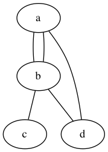

DOT
=========

DOT is a graph description language for <a href="http://www.graphviz.org/" target="_blank">Graphviz</a>.


Introduction
=========

DOT is a plain text graph description language. It is a simple way of describing graphs that both humans and computer programs can use. DOT graphs are typically files that end with the .gv (or .dot) extension.

<ul>
  <li><b><a href="http://www.graphviz.org/Download..php" target="_blank">Install Graphviz</a></b></li>
</ul>

- **Create a file with extension `.dot` or `.gv`**

```go
// The graph name and the semicolons are optional
graph MyGraph {
	a -- b -- c;
	b -- d;
}
```


Undirected Graph
=========
**Undirected Graph is same as 
```go
// The graph name and the semicolons are optional
graph graphname {
	a -- b -- c;
	b -- a;
	d -- a;
	b -- d;
}
```



Directed Graph
=========
```go
digraph graphname {
	a -> b -> c;
	a -> b -> c [color=blue];
	b -> a;
	b -> d;
	d -> a;
	c -> a -> c;
}
```


Attributes
=========
```go
graph graphname {
	// The label attribute can be used to change the label of a node
	a [label="Label A"];

	// Here, the node shape is changed.
	b [shape=box];

	// These edges both have different line properties
	// Set line color as blue
	a -- b -- c [color=blue];

	// Set line style as dotted
	b -- d [style=dotted];
}
```


Label
=========
```go
digraph graphname {
	a [label="Google"]
	b [label="Apple"]
	c [label="UCLA"]
	d [label="Stanford"]
	a -> b [label=50, color=blue];
	b -> c [label=-10, color=red];
	b -> d [label="A", color=green];
}
```
```go
digraph graphname {
	Google -> Apple [label=50, color=blue];
	Apple -> UCLA [label=-10, color=red];
	Apple -> Stanford [label="A", color=green];
}
```


```go
digraph graphname {
	Google -> Apple -> UCLA [label=ShortestPath, color=blue];
	Apple -> Stanford [label="A", color=green];
}
```


Reference
==========
<ul>
  <li><a href="http://www.graphviz.org/" target="_blank">Graphviz</a></li>
  <li><a href="http://www.graphviz.org/content/dot-language" target="_blank">DOT Language</a></li>
  <li><a href="http://en.wikipedia.org/wiki/DOT_(graph_description_language)" target="_blank">Wikipedia DOT</a></li>
</ul>

