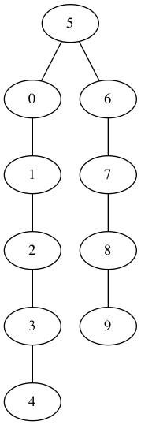
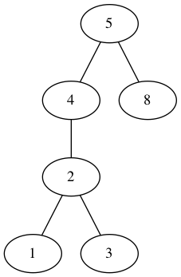
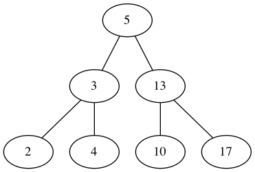
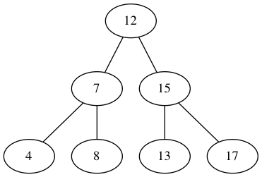

NOT MAINTAINED ANYMORE. MOVED TO [**goraph**](https://github.com/gyuho/goraph).

gotree [](https://travis-ci.org/gyuho/gotree) [](http://godoc.org/github.com/gyuho/gotree) [](http://www.ohloh.net/p/714469)
==========

Package gotree provides tree visualizing tools and algorithm implementations.

- [Getting Started](https://github.com/gyuho/gotree#getting-started)
- [Package Hierarchy](https://github.com/gyuho/gotree#package-hierarchy)
- [What is Tree? (YouTube Clips)](https://github.com/gyuho/gotree#what-is-tree-youtube-clips)
- [Example : Binary Search Tree](https://github.com/gyuho/gotree#example--binary-search-tree)
- [AVL Tree](https://github.com/gyuho/gotree#avl-tree)
- [Example : AVL Tree](https://github.com/gyuho/gotree#example--avl-tree)
- [To-Do-List](https://github.com/gyuho/gotree#to-do-list)
- [Other](https://github.com/gyuho/gotree#other)


Getting Started
==========
- [godoc.org](http://godoc.org/github.com/gyuho/gotree)
- [gowalker.org](http://gowalker.org/github.com/gyuho/gotree#_index)

```go
go get github.com/gyuho/gotree
```

[↑ top](https://github.com/gyuho/gotree#gotree---)


Package Hierarchy
==========
```go
tree/     # Tree Data Structure
  
  bst/    # Binary Search Tree
  bstviz/ # Visualization (Graphviz)
  
  avl/    # AVL Tree
  avlviz/ # Visualization (Graphviz)


example/  # Example Code
```

[↑ top](https://github.com/gyuho/gotree#gotree---)


What is Tree? (YouTube Clips)
========

<a href="https://www.youtube.com/watch?v=NdfIfxTsVDo" target="_blank"></a>
<ul>
  <li class="special"><a href="http://www.youtube.com/watch?v=NdfIfxTsVDo&list=PLT6aABhFfinvsSn1H195JLuHaXNS6UVhf" target="_blank">Tree, Heap, Graph (Playlist)</a></li>
</ul>

[↑ top](https://github.com/gyuho/gotree#gotree---)


Example : Binary Search Tree
==========
```go
tr := bst.NewTree(5)
for i := 0; i < 10; i++ {
	if i != 5 {
		tr = tr.Insert(int64(i))
	}
}
Show(tr, "tree1.dot")
```



<hr>

```go
tr := bst.NewTree(5)
tr.Inserts(7, 8, 5, 4, 2, 1, 6, 3)
Show(tr, "tree2.dot")
```


<hr>

```go
tr := bst.NewTree(5)
tr.Inserts(7, 8, 5, 4, 2, 1, 6, 3)
tr.Delete(int64(6))
Show(tr, "tree3.dot")
```


<hr>

```go
tr := bst.NewTree(5)
tr.Inserts(7, 8, 4, 2, 1, 3)
tr.Delete(int64(7))
Show(tr, "tree4.dot")
```



<hr>

```go
tr := bst.NewTree(5)
tr.Inserts(7, 8, 3, 4, 2, 1, 6)
tr = tr.Delete(int64(5))
Show(tr, "tree5.dot")
```


[↑ top](https://github.com/gyuho/gotree#gotree---)


<hr>


<a href="http://en.wikipedia.org/wiki/AVL_tree" target="_blank">AVL Tree</a>
==========
AVL tree is a self-balancing binary search tree.

For lookup-intensive applications, AVL trees are faster than red-black trees because they are more rigidly balanced. Similar to red-black trees, AVL trees are height-balanced. Both are in general not weight-balanced

**It is basically a Binary Search Tree (BST) with additional balancing property:**

**`Height of the Left Sub-Tree`** and **`Height of the Right Sub-Tree`** differ by at most 1

**Balance(Tree)** = **Height(Left)** - **Height(Right)** = -1, 0, 1

For example,
```
  1
 / \
    2
   / \
  3   4
```
The node 2 is balanced, but the node 1 is NOT balanced
because the Height(Left) is 0 and Height(Right) is 2

##### Insertion
1. Insert into Left-Sub of Left-Child
2. Insert into Right-Sub of Right-Child
3. Insert into Left-Sub of Right-Child
4. Insert into Right-Sub of Left-Child

##### Rotation for Re-balancing
1. LL Rotation
2. RR Rotation
3. LR Rotation
4. RL Rotation

[↑ top](https://github.com/gyuho/gotree#gotree---)

<hr>

##### Rebalance (Rearrange)

**LL Rotation**

Unbalanced!
```
    4
   /
  3
 /
2
```

then
```
   3
  / \
 2   4
```

[↑ top](https://github.com/gyuho/gotree#gotree---)

<hr>

**RR Rotation**

Unbalanced!
```
    6
     \
      7
       \
        8
```

then
```
   7
  / \
 6   8
```

[↑ top](https://github.com/gyuho/gotree#gotree---)

<hr>

**LR Rotation**

Unbalanced!
```
    4
   /
  2
   \
    3
```

then
```
   3
  / \
 2   4
```

[↑ top](https://github.com/gyuho/gotree#gotree---)

<hr>

**RL Rotation**

Unbalanced!
```
    6
     \
      8
     /
    7
```

then
```
   7
  / \
 6   8
```

[↑ top](https://github.com/gyuho/gotree#gotree---)

<hr>

##### Determine which rotation to use
- **`Height(Unbalanced-Node)`** is:
	- **Positive**: Left-Child (Example Height = 2)
		- If **`Height(Left-Child)`** is:
			- Positive: `LL Rotation` (Example Height = 1)
			- Negative: `LR Rotation` (Example Height = -1)
	- **Negative**: Right-Child (Example Height = 2)
		- If **`Height(Right-Child)`** is:
			- Positive: `RL Rotation` (Example Height = 1)
			- Negative: `RR Rotation` (Example Height = -1)

[↑ top](https://github.com/gyuho/gotree#gotree---)


Example : AVL Tree
==========
```go
func main() {
  tr := avl.NewTree(4)
  tr.BalanceInsert(6)
  tr.BalanceInsert(5)
  avlviz.Show(tr, "avl-before.dot")

  tr.BalanceRL(5)
  avlviz.Show(tr, "avl-after.dot")
}
```

**Before**


**After**


[↑ top](https://github.com/gyuho/gotree#gotree---)

<hr>

```go
func main() {
  // Left Left Case
  tr1 := avl.NewTree(13)
  tr1.TreeInserts(5, 17, 3, 10, 4, 2)
  Show(tr1, "avl_balanced_25.dot")

  // Left Right Case
  tr2 := avl.NewTree(13)
  tr2.TreeInserts(5, 17, 3, 10, 12, 9)
  Show(tr2, "avl_balanced_26.dot")

  // Right Right Case
  tr3 := avl.NewTree(7)
  tr3.TreeInserts(4, 12, 8, 15, 17, 13)
  Show(tr3, "avl_balanced_27.dot")

  // Right Left Case
  tr4 := avl.NewTree(7)
  tr4.TreeInserts(4, 12, 9, 15, 8, 10)
  Show(tr4, "avl_balanced_28.dot")
}
```






[↑ top](https://github.com/gyuho/gotree#gotree---)


To-Do-List
==========
**Non-Committal on a Timeline**

- Tree Deletion
- More Tree Data Structures

[↑ top](https://github.com/gyuho/gotree#gotree---)


Other
==========
- <a href="https://code.google.com/p/go-wiki/wiki/Projects?ts=1395809107&updated=Projects#Data_Structures" target="_blank">Data Structure Projects</a>
- <a href="https://github.com/petar/GoLLRB" target="_blank">GoLLRB</a> by Petar Maymounkov (Left-Leaning Red-Black Tree)
- <a href="https://github.com/timtadh/file-structures" target="_blank">File Structures (B+Tree, BTree)</a> by Tim Henderson
- <a href="https://github.com/psankar/btree-go" target="_blank">btree-go</a> by Sankar (B-Tree)

[↑ top](https://github.com/gyuho/gotree#gotree---)


